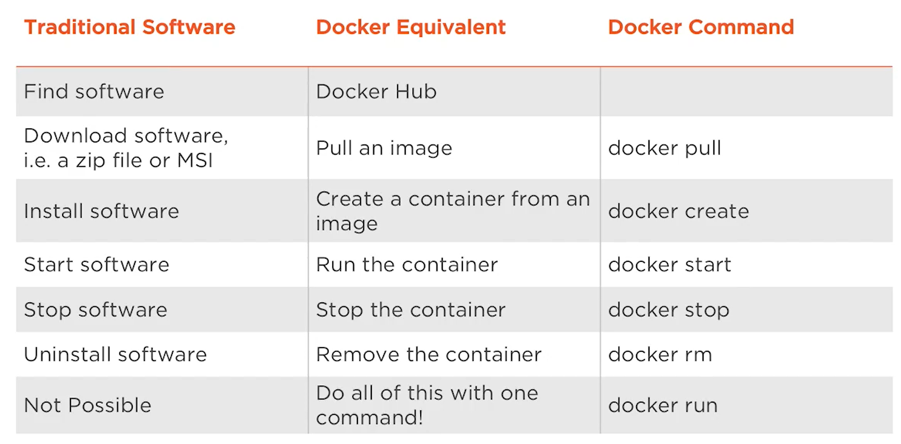

# FT_SERVER

## Description

Webserver deployment with docker.

_This project is aimed to introduce to system administration. It will make aware of the importance of using scripts to automate tasks. For that, it will discover the "docker" technology and use it to install a complete web server. This server will run multiples services: Wordpress, phpMyAdmin, and a SQL database._


## Some terms about Docker

- _Dockerfile_ - a file that describes your steps in order to create a Docker image. It's like a recipe with all ingredients and steps necessary in making your dish.

- _Image_- the snapshot of a virtual machine, but way more lightweight. Images are the building-blocks of the containers. 
Also is containing everything needed to run an application as a container. This includes:
	-- code
	-- runtime
	-- libraries
	-- environment variables
	-- configuration files
The image can then be deployed to any Docker environment and executable as a container.

- _Container_ - the equivalent of creating a VM from a snapshot, but again, way more lightweight. Containers run the applications themselves.


## Differences between tradicional system & Docker

<p align="center">

</p>


## Useful links 

- [Tutorial docker](https://medium.com/codingthesmartway-com-blog/docker-beginners-guide-part-1-images-containers-6f3507fffc98)
- [Docker - differences between RUN vs CMD](https://goinbigdata.com/docker-run-vs-cmd-vs-entrypoint/)
- [Tips about the project](https://harm-smits.github.io/42docs/projects/ft_server)
- [Docker commands](https://www.educative.io/edpresso/how-do-you-write-a-dockerfile)
- [Tutorial ngnix](https://beauvais.me/creer-serveur-web-nginx-php7-maria-db-mysql-debian-9-stretch/)
- [Tutorial](https://www.digitalocean.com/community/tutorials/how-to-install-linux-nginx-mariadb-php-lemp-stack-on-debian-10)
- [Best practices](https://docs.docker.com/develop/develop-images/dockerfile_best-practices/)
- [autoindex](http://nginx.org/en/docs/http/ngx_http_autoindex_module.html)
- [Diferrences between MySQL and MariaDB](https://www.guru99.com/mariadb-vs-mysql.html)
- [Redirect HTTP to HTTPS in Nginx](https://serversforhackers.com/c/redirect-http-to-https-nginx)
- [Create a certificate](https://deliciousbrains.com/ssl-certificate-authority-for-local-https-development/)
- 

## _LINUX_

- _wget_: retrieves files from the web
- _-y --yes_: meaning say yes to all procedure

### Commands

## _DOCKER_

### Commands

- See images status: created, exited
```
$ docker ps -a
```
- Stop containers:
```
$ docker stop (ID or container name)
```
- Remove containers:
```
$ docker rm (ID or container name)
```
- Removing All Unused Objects - containers

The docker system prune command will remove all stopped containers, all dangling images, and all unused networks:
```
$ docker system prune
```
Output ⚠️
```
WARNING! This will remove:
        - all stopped containers
        - all networks not used by at least one container
        - all dangling images
        - all build cache
Are you sure you want to continue? [y/N]
```

- Remove an image
```
$ docker image rm (ID or image name)
```

In this case, '-f' is forcing to stop the image if it were running.
```
$ docker rmi -f (ID or image name)
```

- Listing images
```
$ docker images
```

- Start a container
```
$ docker start [ID or image name]
```

- Running a command in a running container
```
$ docker exec -it hola-pollo bash
```
Output
```
root@d44b14a29991:/#
```

- Copy content inside a container on Windows 🎭
```
$ docker run -d -p 80:80 -v /c/Users/diani/html:/usr/share/nginx/html --name nginx-custom-content nginx                                                                                                  
```

- Copy content inside a container on Mac🍏
```
$ docker run -d -p 80:80 -v ~/Users/diani/html:/usr/share/nginx/html --name nginx-custom-content nginx
```
Then, reload localhost

- Upload to Docker hub
```
$ docker tag mynginx_image2 [user_in_docker_hub]/mynginx_image2
```
```
docker push [user_in_docker_hub]/mynginx_image2
```
- Inspect Networks and other features
```
 docker inspect [ID or container name]
```

### Access to localhost ngnix

To run:
```
$ docker run --rm -d -p 80:80 --name my-nginx nginx
```

- --rm: delete existing container

- -d: Detached, it means the container runs without block the console.

- -p: port, 80:80, the first 80 means is local port. Second 80 means container port. All the traffic is mapped from the second to the first port.

- --name: the name of the container
nginx in this case, is the name of the image


#### Issues: 

##### Localhost is not found! 🛠️

- [Solve issue localhost](https://github.com/nginxinc/docker-nginx/issues/54) 
In case you have problems to run localhost in your machine, probably is because there is another name for it. To find the localhost run:

```
'docker-machine ip default' 
```

This is the address for your localhost:
```
192.168.99.100
```

When you find the address, just put this in your browser and add the port:
```
192.168.99.100:80
```

For docker-machine you can try running open "http://$(docker-machine ip default):8080" or whatever your docker machine name is.

So, accessing http://192.168.99.100:8080 showed the page.

###### Set up name for localhost on Windows 🎭 

- Press the Windows key.
- Type Notepad in the search field.
- In the search results, right-click Notepad and select Run as administrator.
- From Notepad, open the following file: c:\Windows\System32\Drivers\etc\hosts.
- Make the necessary changes to the file. Put name different to localhost (reserved keyword)
- Select File > Save to save your changes.

##### EXAMPLE 

```
$ docker run -p 8080:80 -id nginx
```

```
$ docker ps
```

```
CONTAINER ID        IMAGE               COMMAND                  CREATED             STATUS              PORTS                           NAMES
903923b67a8a        nginx               "nginx -g 'daemon off"   5 seconds ago       Up 5 seconds        443/tcp, 0.0.0.0:8080->80/tcp   reverent_wing
```


📌🎁📢☕🍺🖇️✒️📦📄⌨️🔩🚀📋🔧

touch on Mac is 'echo $null >> index.html' on Windows

## Php

https://www.itzgeek.com/how-tos/linux/debian/how-to-install-php-7-3-7-2-7-1-on-debian-10-debian-9-debian-8.html


The LEMP software stack is a group of software that can be used to serve dynamic web pages and web applications. The name “LEMP” is an acronym that describes a Linux operating system, with an (E)Nginx web server. The backend data is stored in a MariaDB database and the dynamic processing is handled by PHP.


- [Packages](https://packages.debian.org/source/sid/php7.4)
- [PHP Manual](https://www.php.net/manual/es/index.php)

- *php7.4-bcmath*: Bcmath module for PHP - BCMath Arbitrary Precision Mathematics (No needed for this project)
- *php7.4-dba*: DBA module for PHP
- *php7.4-bz2*: bzip2 module for PHP - The bzip2 functions are used to transparently read and write bzip2 (.bz2) compressed files.(No needed for this project)
- *php7.4-cgi*: server-side, HTML-embedded scripting language (CGI binary)
- *php7.4-dev*:Files for PHP7.4 module development
- *php7.4-enchant*: Enchant module for PHP -  Enchant steps in to provide uniformity and conformity on top of all spelling libraries, and implement certain features that may be lacking in any individual provider library.
- *php7.4-cli*: command-line interpreter for the PHP scripting language
- *php7.4*: server-side, HTML-embedded scripting language (metapackage)
- *php7.4-common*: documentation, examples and common module for PHP
- *php7.4-curl*: CURL module for PHP - (Client URL) PHP supports libcurl, that allows you to connect and communicate to many different types of servers with many different types of protocols. libcurl currently supports the http, https, ftp, gopher, telnet, dict, file, and ldap protocols. libcurl also supports HTTPS certificates, HTTP POST, HTTP PUT, FTP uploading (this can also be done with PHP's ftp extension), HTTP form based upload, proxies, cookies, and user+password authentication.
- *php7.4-fpm*: server-side, HTML-embedded scripting language (FPM-CGI binary) - FPM (FastCGI Process Manager) is an alternative PHP FastCGI implementation with some additional features (mostly) useful for heavy-loaded sites.
- *php7.4-gd*: GD module for PHP -  Graphics draw (images). GD is an open source code library for the dynamic creation of images
- *php7.4-gmp*: GMP module for PHP - GNU Multiple Precision Arithmetic Library
- *php7.4-imagick*:Imagick is a native php extension to create and modify images using the ImageMagick API. ImageMagick is a software suite to create, edit, and compose bitmap images. It can read, convert and write images in a variety of formats (over 100) including DPX, EXR, GIF, JPEG, JPEG-2000, PDF, PhotoCD, PNG, Postscript, SVG, and TIFF.
- *php7.4-imap*: IMAP module for PHP - These functions enable you to operate with the IMAP protocol, as well as the NNTP, POP3 and local mailbox access methods.
- *php7.4-interbase*: Interbase module for PHP
- *php7.4-intl*: Internationalisation module for PHP - Internationalization extension (further is referred as Intl) is a wrapper for » ICU library, enabling PHP programmers to perform various locale-aware operations including but not limited to formatting, transliteration, encoding conversion, calendar operations, » UCA-conformant collation, locating text boundaries and working with locale identifiers, timezones and graphemes.
- *php7.4-json*: JSON module for PHP
- *php7.4-ldap*: LDAP module for PHP - LDAP is the Lightweight Directory Access Protocol, and is a protocol used to access "Directory Servers". The Directory is a special kind of database that holds information in a tree structure.
- *php7.4-mbstring*: MBSTRING module for PHP - mbstring provides multibyte specific string functions that help you deal with multibyte encodings in PHP. In addition to that, mbstring handles character encoding conversion between the possible encoding pairs. mbstring is designed to handle Unicode-based encodings such as UTF-8 and UCS-2 and many single-byte encodings for convenience
- *php7.4-mysql*: MySQL module for PHP
- *php7.4-odbc*: ODBC module for PHP
- *php7.4-opcache*: Zend OpCache module for PHP
- *php7.4-pgsql*: PostgreSQL module for PHP
- *php7.4-phpdbg*: server-side, HTML-embedded scripting language (PHPDBG binary)
- *php7.4-pspell*: pspell module for PHP
- *php7.4-readline*: readline module for PHP
- *php7.4-snmp*: SNMP module for PHP
- *php7.4-soap*: SOAP module for PHP - SOAP (Simple Object Access Protocol) is a messaging protocol specification for exchanging structured information in the implementation of _web services_ in computer networks. Its purpose is to provide extensibility, neutrality, verbosity and independence.
- *php7.4-sqlite3*: SQLite3 module for PHP
- *php7.4-sybase*: Sybase module for PHP
- *php7.4-tidy*: tidy module for PHP - Tidy is a binding for the Tidy HTML clean and repair utility which allows you to not only clean and otherwise manipulate HTML, XHTML, and XML documents, but also traverse the document tree, including ones with embedded scripting languages such as PHP or ASP within them using object oriented constructs.
- *php7.4-xml*: DOM, SimpleXML, XML, and XSL module for PHP - XML (eXtensible Markup Language) is a data format for structured document interchange on the Web.
- *php7.4-xmlrpc*: XMLRPC-EPI module for PHP- It's a spec and a set of implementations that allow software running on disparate operating systems, running in different environments to make procedure calls over the Internet. It's remote procedure calling using HTTP as the transport and XML as the encoding. XML-RPC is designed to be as simple as possible, while allowing complex data structures to be transmitted, processed and returned.
⚠️ This extension is EXPERIMENTAL. The behaviour of this extension including the names of its functions and any other documentation surrounding this extension may change without notice in a future release of PHP. This extension should be used at your own risk.
- *php7.4-xsl*: XSL module for PHP (dummy)
- *php7.4-zip*: Zip module for PHP


debian:buster
Buster is the development codename for Debian 10. It is the current stable distribution.

https://docs.phpmyadmin.net/en/latest/config.html#config-examples

This will tell Nginx to use the configuration next time it is reloaded. You can test your configuration for syntax errors by typing:

```
nginx -t
```
## Wordpress

https://wordpress.org/support/article/editing-wp-config-php/

## Eval

- Verify if you can run the container with "docker run xxx" without problems. (xxx is the name of the docker you've just built)

$ docker run -d -p 80:80 my_image service nginx start
This succeeds in starting the nginx service inside the container. However, it fails the detached container paradigm in that, the root process (service nginx start) returns and the detached container stops as designed. As a result, the nginx service is started but could not be used. Instead, to start a process such as the nginx web server do the following:
$ docker run -d -p 80:80 my_image nginx -g 'daemon off;'


how do people here interpret You will also need to make sure your server is running with an index that must beable to be disabled. in ft_server? Kinda confused what they mean here (edited) 

Nginx has the habily to show you an index page of the files existing in the root folder, which can be turned on or off in the nginx config
http://nginx.org/en/docs/http/ngx_http_autoindex_module.html 


Basically you have a clean installed server. do everything you would do to install it on a new server. If you want terms to google: apt, aptitude, LAMP stack, Wordpress NGINX and Apache